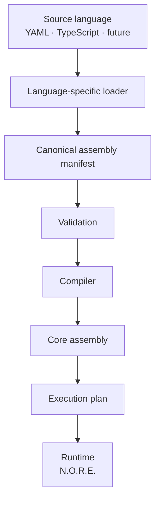
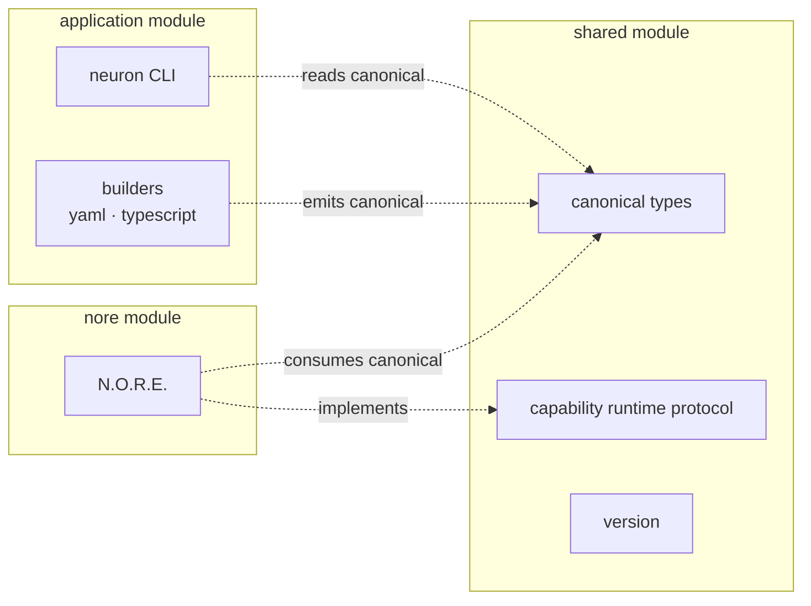
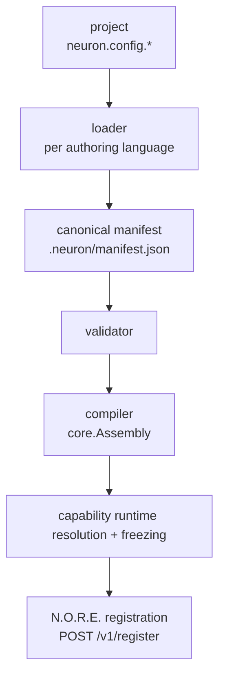
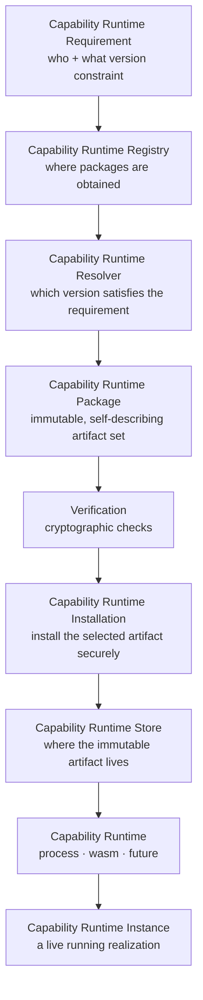
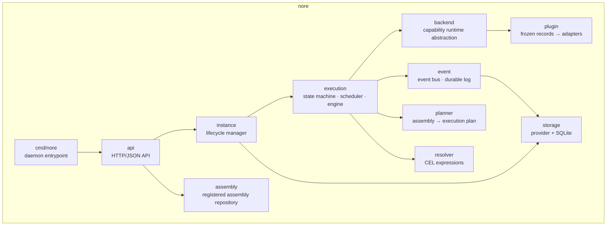
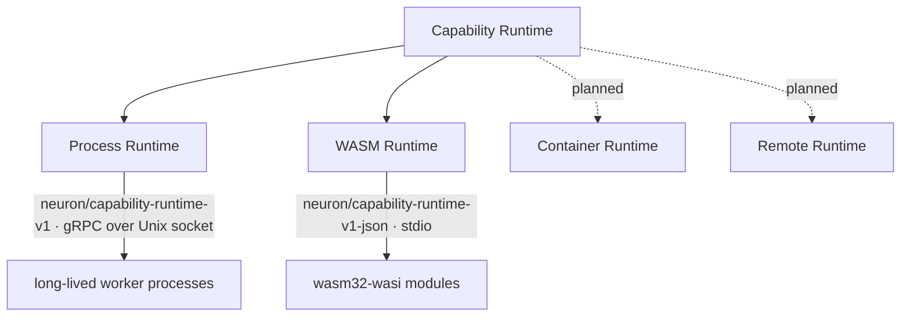
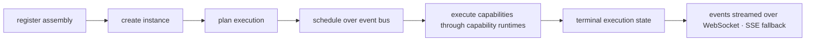
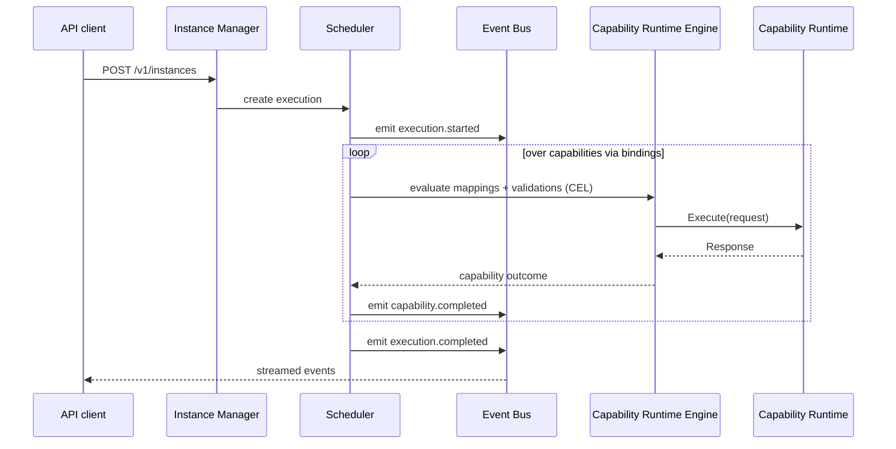
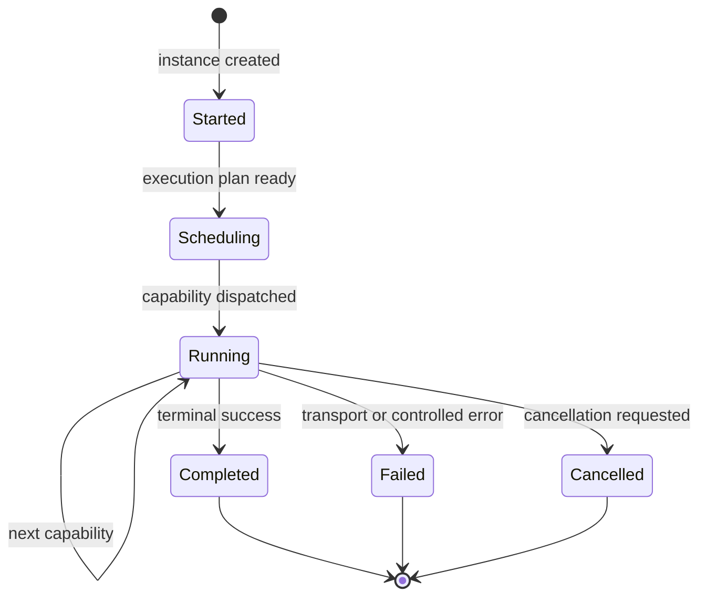
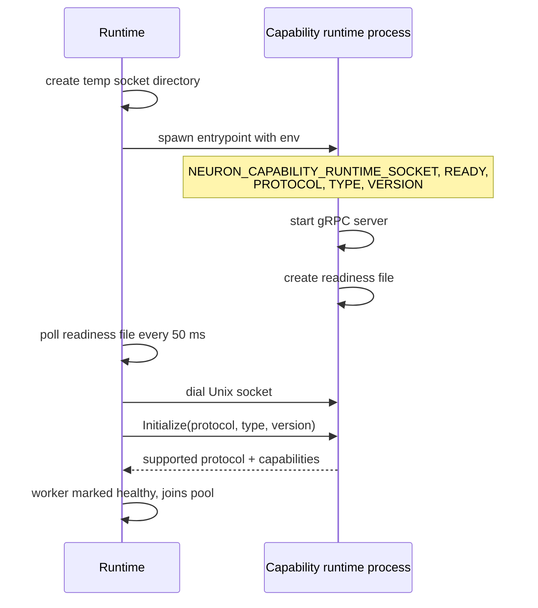

# Architecture

Neuron is a runtime for building and operating complex software systems from composable, executable capabilities. This document is the architecture reference for the whole platform: the canonical model every authoring surface converges on, the boundaries that must never blur, and — in depth — how N.O.R.E. turns a registered assembly into running capabilities.

> [!TIP]
> Reading paths:
>
> - **New to Neuron** — [The core idea](#the-core-idea), [The canonical pipeline](#the-canonical-pipeline), [What lives where](#what-lives-where).
> - **Authoring an assembly** — [Assembly definition](#assembly-definition), [Authoring surfaces](#authoring-surfaces), [Building & loading](#building--loading).
> - **Understanding the runtime** — [N.O.R.E. at a glance](#nore-at-a-glance), [The execution model](#the-execution-model), [Executing one capability](#executing-one-capability).
> - **Implementing or hosting capability runtimes** — [The capability runtime contract](#the-capability-runtime-contract), [The process runtime](#the-process-runtime), [The WASM runtime](#the-wasm-runtime).

---

## The core idea

Modern software is composed of applications, services, workers, libraries, queues, databases, APIs, and infrastructure. As systems grow, the hard part stops being any individual component and becomes making all of them work together as one coherent system.

Neuron's answer is to stop making the runtime understand what a component *is* and instead make it understand what a component *does* — and how it connects. Everything executable is a **capability**: described by a contract, reached through a relationship, and operated by a runtime that does not need to know how it is implemented.

> [!IMPORTANT]
> Software should be composed from things that can do something, connected by explicit relationships, and operated by a runtime that does not need to understand what those things are.

This leads to a deliberately small set of primitives:

| Primitive | Responsibility | What it never knows |
| --- | --- | --- |
| **Assembly** | Defines what exists and how it is connected | How capabilities are implemented |
| **Module** | An executable capability packaged for Neuron | The composition it belongs to |
| **Capability** | Exposes one executable capability | How the capability is executed |
| **Capability Runtime** | Provides the machinery that runs a Capability | The composition of the Assembly |
| **Binding** | Defines how two capabilities communicate | The business meaning of the data |
| **Instance** | A living realization of an Assembly | Implementation details of its Capabilities |
| **N.O.R.E.** | Operates registered Assemblies — instantiate, schedule, execute | What any capability actually means |

The separation between **Capability** and **Capability Runtime** is the load-bearing wall. It is what lets Neuron host capabilities implemented in any technology without turning the core into a collection of special cases: the Capability stays logical, the Capability Runtime stays mechanical, and the runtime only ever sees the capability runtime boundary.

---

## Design goals

In priority order:

1. **Correctness** — behavior is defined, bounded, and tested at the right boundary.
2. **Architectural integrity** — one authoritative place for every important domain behavior, no competing models.
3. **Isolation** — source languages never leak into the runtime; the runtime never parses author input.
4. **Security** — external capability runtimes are untrusted code and are hosted accordingly.
5. **Performance** — concurrency and worker reuse are first-class, measured, not assumed.
6. **Scalability** — the primitive model composes from one service to distributed systems.
7. **Maintainability** — packages own a single responsibility and are named after it.
8. **Clear public APIs** — the SDK, the capability runtime protocol, and the CLI are contracts.
9. **Testability** — behavior is exercised through stable boundaries.
10. **Documentation** — intent and constraints are explained where they matter.

---

## The canonical pipeline

All authoring surfaces converge on one canonical representation before anything language-, runtime-, or technology-specific happens:



Nothing downstream of the **canonical manifest** knows how an assembly was authored. YAML assemblies and TypeScript assemblies produce the same manifest, compile through the same compiler, and run on the same runtime.

---

## What lives where

The repository is a monorepo organized into strictly separated Go modules:

| Path | Responsibility |
| --- | --- |
| `application/` | The `neuron` CLI — authoring, building, module resolution, client, daemon bootstrap |
| `nore/` | N.O.R.E. — the Neuron Operational Runtime Engine |
| `shared/` | Canonical types, capability runtime contract, version — agreed on by both Go modules |
| `packages/assembly-sdks/typescript/` | `@neuron/sdk` — TypeScript assembly-definition language |
| `packages/executor-sdks/golang/` | Go SDK for authoring Neuron modules (capability runtimes) |
| `packages/executor-sdks/dotnet/` | .NET SDK for authoring Neuron modules (`Neuron.Executor`) |
| `examples/` | Runnable example assemblies and reference capability runtimes |
| `docs/` | Getting started, architecture, installation, and module docs |
| `scripts/` | Workspace development and release helpers |

The important fact: `application` and `nore` are **separate Go modules** that only agree through the canonical types and protocol contracts in `shared`. The CLI never reaches into the runtime's internals; the runtime never reads YAML or TypeScript.



The version reported by `neuron version` and `nore --version` comes from a single source, `shared/version`, stamped at build time via `-ldflags`.

---

## Assembly definition

An **Assembly** is a composition of capabilities and the explicit relationships between them. The canonical YAML form mirrors the manifest structure in `examples/ecommerce_order`:

```yaml
# assemblies/order-processing/assembly.yaml
apiVersion: neuron/v1
kind: Assembly

metadata:
  name: order-processing
  version: 1.0.0
  description: Order processing pipeline

capabilities:
  - ref: validate-order
    entry: ../../capabilities/validate-order.yaml
  - ref: parse-order
    entry: ../../capabilities/parse-order.yaml

bindings:
  - from: validate-order
    to: parse-order
    mappings:
      - target: validation_data
        expression: "source.result"
    validations:
      - expression: "source.result.valid == true"
        message: "Order validation failed"
```

A **Capability** names the logical unit and the capability runtime that provides it:

```yaml
# capabilities/validate-order.yaml
apiVersion: neuron/v1
kind: Capability

metadata:
  name: validate-order
  version: 1.0.0
  description: Validate incoming order request

spec:
  capability runtime:
    type: neuron:core:set
    runtimeConfig:
      execution:
        mode: wait
        timeout: 5s

  config:
    status: validated
    valid: true

  mappings:
    - direction: input
      source: execution.params.order
      target: order
```

`runtimeConfig` declares how N.O.R.E. should *drive* the capability through its capability runtime — execution mode, timeout, retry behavior, and reserved resource constraints. It is grouped deliberately (`execution`, `retry`, `resources`), is per capability, and is never capability input. Every field is optional; N.O.R.E. supplies its own defaults for anything unset.

Execution flows along the bindings. Each binding defines what data flows between the two capabilities (`mappings`, expressed in CEL) and optionally which conditions must hold (`validations`). Execution params are available to expressions as `execution.params`; the upstream capability's result as `source.result`.

---

## Authoring surfaces

### YAML

The YAML surface is the canonical, zero-tooling authoring experience. A project is a directory with `neuron.config.yaml` pointing at a `kind: Assembly` entry file (`assembly.yaml` by default). `neuron init` scaffolds it, and `neuron build` consumes it. See `examples/ecommerce_order` for a complete project.

### TypeScript — the SDK

The TypeScript SDK (`@neuron/sdk`) is the same capability: a typed, always-autocompleted way to describe assemblies in TypeScript, converging on the same canonical manifest.

```ts
// assembly.ts
import { Capability, Assembly } from "@neuron/sdk";

const validate = Capability({
  name: "validate-order",
  version: "1.0.0",
  description: "Validate an incoming order",
})
  .runtime({ name: "neuron:core:set" })
  .paramsSchema<{ order: object }>()
  .resultSchema<{ order: object; valid: boolean }>();

export default Assembly({
  name: "order-processing",
  version: "1.0.0",
})
  .paramsSchema<{ order: object }>()
  .withParams((data) => validate.withParams({ order: data.order }))
  .toManifest();
```

The SDK is a **definition tool**. It describes assemblies; it does not execute them, and it must never become a runtime. The Go side remains responsible for parsing, validating, compiling, and running the canonical representation. See [packages/assembly-sdks/typescript/README.md](../packages/assembly-sdks/typescript/README.md).

---

## Building & loading

Each authoring surface has a dedicated loader in `application` (`application/build/yaml`, `application/build/typescript`). A loader's only job is to translate its source language into the **canonical manifest** — plus project-level concerns (paths, variables, entry points).

The pipeline in `neuron build`:



The validator and compiler are language-agnostic: they consume and emit canonical structures. YAML-specific quirks stay inside the YAML loader; TypeScript-specific quirks stay inside the TS loader.

The TypeScript loader delegates the actual build to the SDK CLI (`neuron-sdk build --path <root> --entry <file>`), which executes the entry module and writes `.neuron/manifest.json` — then the same canonical path continues. The entry file is selected the same way for both authors: the project's `neuron.config.*` `entry` field.

---

## The compiler boundary

The compiler transforms the canonical manifest into the runtime/core structures N.O.R.E. consumes.

> [!WARNING]
> The compiler MUST remain source-language agnostic. It MUST NOT parse YAML or TypeScript, resolve GitHub repositories, download or install capability runtimes, launch processes, execute capabilities, own HTTP clients, or contain registry-specific behavior.

Those responsibilities belong to their own layers. The compiler is pure transformation: canonical manifest in, core assembly out.

---

## The module & capability runtime model

A module is the public word for a capability packaged for Neuron. Within the model, a capability runtime is distilled through a chain of distinct responsibilities:



No two steps merge:

| Step | Answers | Owns |
| --- | --- | --- |
| **Registry** | *Where* | Providers (`github`, `local`, future registries) |
| **Resolver** | *Which* | Best version by semantic versioning, above the providers; prefers already-installed artifacts so running instances stay independent of the network |
| **Installer** | *How* | Verifying and installing the selected package archive |
| **Store** | *Where it lives* | The immutable installed artifact, keyed by name and exact version, under `~/.neuron/capabilityRuntimes` |
| **Runtime** | *How it executes* | Spawning, supervising, and terminating capability runtime workers |

The CLI runs this pipeline during `neuron build` and then **freezes** the exact resolved versions into the build record. N.O.R.E. therefore never resolves modules itself — it receives a closed set of resolved capability runtimes and launches instances from them.

Built-in modules are the exception that proves the rule: they run in-process inside N.O.R.E., so resolution skips them and the runtime dispatches them directly. See [docs/MODULES.md](./MODULES.md) for the full model.

---

# Part II — N.O.R.E.

**N.O.R.E. (Neuron Operational Runtime Engine)** is the daemon that registers assemblies, creates instances, executes them, and persists their records. It is the operating environment of an assembly: it owns processes, memory, communication, isolation, resources, and scheduling — one level above what a capability runtime owns for itself.

## N.O.R.E. at a glance

| Concern | Responsibility |
| --- | --- |
| **Registration** | Receiving compiled Assembly definitions from the CLI and persisting them |
| **Execution planning** | Compiling the registered assembly and its frozen capability runtime set into a plan over an event bus |
| **Instances** | Creating, running, pausing, restarting, and removing living realizations of Assemblies |
| **Capability runtimes** | Hosting and supervising modules — in-process for built-ins, out-of-process for external modules (process and WASM backends) |
| **Scheduling** | Advancing executions, evaluating binding mappings and validations, handling cancellations |
| **Persistence** | Durable storage of registered assemblies, instances, executions, and events through an interchangeable storage provider (SQLite by default) |
| **API** | The local HTTP/JSON transport over which the CLI talks to the runtime |

N.O.R.E. deliberately does **not**:

- parse YAML or TypeScript,
- resolve or install external modules (the CLI does that and freezes the result),
- understand the business meaning of the modules it operates.

The canonical manifest is compiled by the CLI; N.O.R.E. receives the compiled core assembly representation.

## Internal architecture



| Package | Responsibility |
| --- | --- |
| `cmd/nore` | Daemon entry point — flags, listeners, token, shutdown |
| `api` | HTTP/JSON API — transport only: validates requests, calls the instance manager and assembly repository, serializes responses and streams. Never interprets assembly semantics |
| `instance` | Lifecycle — create/remove/clear, restoration on startup, registry of live instances |
| `execution` | State machine — scheduler transitions, snapshotting, wait-for-completion, the capability runtime engine that drives module calls, and the execution store (in-memory, write-through to storage) |
| `event` | Single source of truth for state transitions; the durable event log used for persistence and streaming |
| `backend` | Capability runtime backend abstraction — one interface, multiple backends (process workers, WASM), with health checks, worker pooling, restart, and cancellation |
| `planner` | Compiles the registered Assembly + frozen capability runtimes into an executable plan. Source-language agnostic; owns no HTTP clients, registries, or file downloads |
| `resolver` | CEL expression resolver — binding mappings and validations |
| `storage` | Provider interface + SQLite implementation — assemblies, instances, executions, events |
| `plugin` | Boundary between frozen capability runtime records and the runtime backends — thin adapters, no process/socket/WASM machinery itself |
| `assembly` | Registered assembly repository and indexing |

### The capability runtime boundary

The runtime boundary inside N.O.R.E. is the **capability runtime** abstraction. One interface, multiple backends:



A backend owns starting the capability runtime, connecting to it, health checking, executing requests, cancellation, deadlines, termination, and restart. The registry, installer, and compiler own none of that.

## Running N.O.R.E.

In normal use you never run N.O.R.E. directly — the `neuron` CLI starts it automatically and talks to it over a Unix domain socket. The binary lives alongside the CLI in the same distribution archive.

To run it by hand (for development or debugging):

```bash
go build -o nore ./nore/cmd/nore
./nore
```

With no flags this binds a Unix socket (`~/.neuron/nore.sock`) and uses `~/.neuron/nore` as its data directory. The process is a plain foreground process and shuts down cleanly on `SIGINT`/`SIGTERM`.

### Flags

| Flag | Meaning |
| --- | --- |
| `-port` | TCP address for the N.O.R.E. API; empty disables TCP (default: Unix socket only) |
| `-socket` | Unix socket for local CLI clients; empty disables Unix socket (default: `$NEURON_SOCKET` or `~/.neuron/nore.sock`) |
| `-workers` | Capability runtime worker count (default 8) |
| `-data-dir` | Persistent data directory (default: `$NEURON_DATA_DIR` or `~/.neuron/nore`) |
| `-token` | API token for authenticating requests; empty loads the token from the socket's token file |
| `-version` | Print the N.O.R.E. version and exit |

At least one of `-port` or `-socket` must be configured.

> [!NOTE]
> The default configuration is **Unix socket only** — no TCP listener is opened unless `-port` is supplied explicitly. The socket is created with mode `0600`, so only the owning user can connect to the runtime API.
>
> Exposing N.O.R.E. over TCP is opt-in and intended for development and remote operation where the deployment enforces its own network-level protection. A TCP listener refuses to start without a token.

### Configuration & environment

| Variable | Meaning |
| --- | --- |
| `NEURON_SOCKET` | Override the daemon Unix socket path |
| `NEURON_DATA_DIR` | Override the daemon persistent data directory |
| `NEURON_API_TOKEN` | API token presented by a client that cannot read the socket's token file |
| `NEURON_API_TOKEN_FILE` | Relocate the token file from `<socket>.token` |

Command-line flags take precedence over environment variables.

### API surface

| Endpoint | Operation |
| --- | --- |
| `GET /health` | Health check (used by the CLI bootstrap) |
| `POST /v1/register` | Register a compiled Assembly |
| `GET /v1/instances` | List Instances |
| `POST /v1/instances` | Create an Instance and begin execution |
| `DELETE /v1/instances` | Remove all Instances |
| `GET /v1/instances/{id}` | Instance detail |
| `DELETE /v1/instances/{id}` | Remove an Instance |
| `POST /v1/instances/{id}/executions` | Create an execution |
| `GET /v1/instances/{id}/executions` | List executions |
| `GET /v1/instances/{id}/executions/{execID}` | Execution state |
| `GET /v1/instances/{id}/executions/{execID}/events` | List events |
| `GET /v1/instances/{id}/executions/{execID}/events/stream` | Stream events (Server-Sent Events) |
| `WS /v1/ws` | WebSocket endpoint for live event streaming |

## The capability runtime contract

Everything the runtime knows about a capability runtime is defined in `shared/types/capabilityruntime`. This module is the contract both sides compile against. It is deliberately dependency-free and carries no registry, resolver, or installer machinery.

Three pieces matter.

### The manifest (`runtime.json`)

Describes one immutable artifact: its name and version, its runtime kind, its entrypoint, its declared protocol, its capabilities, and its per-platform artifacts.

```json
{
  "apiVersion": "neuron/v1",
  "kind": "CapabilityRuntime",
  "metadata": { "name": "my:capability", "version": "1.2.0" },
  "runtime":  { "type": "process", "entrypoint": "capability", "protocol": "neuron/capability-runtime-v1" },
  "capabilities": ["capability"],
  "features": [],
  "platforms": { "linux-amd64": { "artifact": "capability-linux-amd64", "sha256": "..." } }
}
```

`runtime.type` selects the backend (`process` or `wasm`); the `protocol` selects the transport; `maxWorkers` (optional) bounds the worker pool for process capability runtimes. Validation requires a correct `apiVersion` and `kind`, a name, a version, a runtime type, an entrypoint, and at least one capability.

`platforms` keys are selected by the runtime kind: process capability runtimes bind the host's native key (`linux-amd64`, …) because the artifact runs on the N.O.R.E. machine, while WASM capability runtimes bind the portable `wasm32-wasi` key. The mapping lives in one place, `PlatformForRuntime` (`application/capabilityruntime/model.go`). The preferred distribution unit is the capability runtime package archive (`<name>-<version>-capability-runtime.neuron.tar.gz`) carrying `runtime.json` plus every platform artifact; registries prefer it over per-platform assets and the installer reconciles its inner manifest against the resolved identity.

Manifests declare the protocol honestly:

- a gRPC-capable process capability runtime declares `neuron/capability-runtime-v1`;
- a WASI module or legacy command declares `neuron/capability-runtime-v1-json`.

### The protocol

Defines the wire data model of an execution: a `Request` with a `Params` map, and a `Response` with a `Result` map and an optional `Error` string. Two transports carry this data:

| Protocol | Transport | Used by |
| --- | --- | --- |
| `neuron/capability-runtime-v1` | gRPC (protobuf) over a Unix domain socket | Process capability runtimes (canonical) |
| `neuron/capability-runtime-v1-json` | One-shot line-delimited JSON over stdio | WASI modules and legacy process capability runtimes |

The gRPC surface is `CapabilityRuntimeService` in `shared/protocol/capabilityruntime/v1/capability_runtime.proto`, with `Initialize`, `Execute`, `Health`, and `Shutdown` RPCs. It carries the handshake, protocol version, identity, capabilities, structured input/output/errors, cancellation, deadlines, and health.

> [!NOTE]
> A non-empty `Error` in a response is a **controlled failure**, even when the process exits zero.

### The backend contract

Three Go interfaces define how a backend hosts an artifact:

```go
type Backend interface {
    Start(ctx context.Context, spec BackendSpec) (BackendInstance, error)
    BackendName() string
}

type BackendInstance interface {
    Execute(ctx context.Context, req *Request) (*Response, error)
    Health(ctx context.Context) error
    Close(ctx context.Context) error
}
```

`BackendSpec` carries everything needed to launch one artifact: the capability runtime type and version, the declared protocol, the absolute entrypoint path, the install root, and an optional worker-pool bound. The returned `BackendInstance` is the uniform execution handle — regardless of whether the underlying capability runtime is a child process, a WASM module, a container, or a remote service.

## The backend registry and dispatch

A single registry (`nore/internal/backend.Registry`) owns runtime backends and the instances they launch. Backends register themselves by kind:

```go
reg := backend.New()
reg.Register("process", processRuntime)
reg.Register("wasm", wasmRuntime)
```

`Start(kind, spec)` looks up the backend for the kind and dispatches. If no backend is registered for the requested kind, the start fails with an explicit error listing the supported kinds — a frozen artifact that declares an unsupported or unknown runtime type is **never silently mis-executed**.

`SupportedRuntimeKinds()` in `shared/types/capabilityruntime` lists the two kinds the runtime layer can actually launch: `process` and `wasm`. The `container` and `remote` kinds are reserved for the future and currently rejected.

The registry also tracks launched instances by `type@version`. Closing an instance removes it from the registry; `CloseAll` drains every tracked instance.

In the running process there is a single **shared** registry, built lazily and shared by every instance:

- the WASM backend owns process-global compiled-module state that every WASM adapter must share;
- the process backend tracks its worker pools by capability runtime identity, so two instances of the same assembly legitimately share one pool per capability runtime.

## Core and external capability runtimes

There are two ways a capability type gets a capability runtime.

**Core in-process capability runtimes.** N.O.R.E. ships built-ins for common operations. They run inside the N.O.R.E. process and require nothing to be installed, resolved, or launched:

| Capability type | Behavior |
| --- | --- |
| `neuron:core:set` | Sets static values from config |
| `neuron:core:ai` | In-process mock/placeholder capability runtime |
| `neuron:core:log` | Logs its input |
| `neuron:core:http` | Makes an HTTP request |
| `neuron:core:delay` | Waits a configured interval |
| `neuron:core:command` | Runs an OS command |

They are registered by `RegisterCoreRuntimes` in `nore/internal/registry`, under both the canonical namespaced name (`neuron:core:set`, …) and the legacy bare name.

**External capability runtimes.** Anything else is hosted by a runtime backend. An external capability runtime is an installed artifact (a native binary or a WASM module) that speaks one of the two declared wire protocols. External capability runtimes are declared as requirements in an assembly, resolved to exact versions at register time, frozen into the deployment as `ResolvedCapabilityRuntime` records, and launched by a runtime backend when the assembly becomes an instance.

The distinction is decided in `nore/internal/plugin.RegisterResolvedCapabilityRuntimes`: a frozen capability runtime is only registered if no core capability runtime already exists for the same capability type. **Core capability runtimes always win.**

## The adapter boundary

`nore/internal/plugin` is the boundary between frozen capability runtime records and the runtime backends. It owns no process, socket, or WASM machinery itself. It only maps a `ResolvedCapabilityRuntime` onto the contract N.O.R.E.'s capability runtime engine consumes.

`NewAdapter` reads the frozen record's runtime kind and builds a `BackendSpec`:

- an empty runtime kind defaults to `process` (the original capability runtime model);
- an empty protocol defaults to `neuron/capability-runtime-v1-json` so legacy capability runtimes that omit the declaration keep speaking JSON;
- the entrypoint is resolved to an absolute path via `EntrypointPath()`;
- `maxWorkers` from the frozen record is passed through.

It then calls the shared registry's `Start(kind, spec)`. The returned instance is wrapped in an adapter that maps the engine's `ExecutionContext` to a `Request` and back, and turns a non-empty response error into a Go error.

## Instance lifecycle

An Assembly definition is static. An **Instance** is a living realization with its own state. Instances are created from a registered assembly, and each creation plans and runs the assembly across its capabilities:



**Register.** `neuron build` builds the project, compiles it to an assembly, resolves every capability runtime requirement against the configured catalogs, installs what is missing, and freezes the exact resolutions into the deployment. The deployment never resolves or installs again. Frozen records are `ResolvedCapabilityRuntime` values: type, requested constraint, exact resolved version, registry, digest, runtime info, and the absolute install root.

**Instance creation.** An instance of the assembly is created on demand through `Manager.GetOrCreate` (`nore/internal/instance`). The manager reads the durable registered assembly, decodes the frozen capability runtime set from the opaque `ExecutionConfigurations` payload, and constructs the instance. Construction:

1. builds the event bus, execution store, scheduler, capability runtime engine, and analytics,
2. registers the core in-process capability runtimes,
3. registers a runtime adapter for every frozen external capability runtime (`plugin.RegisterResolvedCapabilityRuntimes`), and
4. compiles the blueprint for the assembly.

**Start.** `Instance.Start` sets the status to `running` and launches five concurrent loops: analytics, scheduler, capability runtime engine, event persistence, and execution persistence. Until this point nothing is listening.

**Stop.** `Instance.Stop` cancels the instance context, waits for in-flight work to drain, closes the capability runtime registry (which closes every registered adapter, releasing runtime-backed resources), and persists the stopped status.

> [!WARNING]
> Instances survive runtime restarts as **metadata-only** records: on startup, N.O.R.E. restores persisted instances and their executions so they stay queryable, but a restored instance has no runtime and cannot be started. Creating a new instance is how work is re-run.

### Safe shutdown

On `SIGINT`/`SIGTERM`, N.O.R.E. closes its listeners and then **gracefully stops all live instances** before exiting (`srv.StopInstances()`), so capability-runtime-backed resources — worker processes and WASM modules — receive a clean shutdown instead of being torn down mid-operation by process exit. In-flight executions are flushed to storage before storage is closed.

---

# Part III — Execution

## The execution model

N.O.R.E. treats every capability as a capability runtime. An execution is always a request/response operation at its core: **input → execution → output** (with stderr, status, and structured errors alongside). The runtime itself does not know what a capability does. It only knows the contract every capability runtime speaks: a params map in, a result map (or a structured error) out. Whatever the capability is — a database query, an HTTP call, a WASM module, a native binary, a remote API — the runtime sees the same shape.

> [!IMPORTANT]
> One Assembly can mix capabilities executed in completely different ways. This is a core property of N.O.R.E.: the Assembly composes capabilities; the runtime hosts them; the capability runtime contract keeps those two independent.

## Executing one capability

When an execution flows through the assembly, a capability's capability runtime is resolved from the registry (core capability runtime or adapter) and invoked with an `ExecutionContext`: the execution and correlation IDs, the capability definition, the resolved params, the capability's effective runtime configuration, and a logger bound to the execution.

The `ExecutionContext` keeps two things rigorously apart:

| Field | Owned by | Reaches the capability runtime? |
| --- | --- | --- |
| `Params`, `CapabilityConfigurations` | the author's declaration | Yes — this is capability input |
| `RuntimeConfig` | N.O.R.E. | No — it tells the engine how to drive the invocation |

A `runtimeConfig` is resolved from the capability's runtime declaration, not from its input. The planner fills in N.O.R.E.'s defaults **once, when the plan is built**, so the engine always sees a complete configuration and no per-invocation defaulting cost is paid. The registered assembly keeps the configuration exactly as authored; defaults live on the plan and never mutate it. As a result, changing a default never rewrites a deployed assembly and never changes an assembly's identity hash — only what the author explicitly declares is frozen into the hash.

The engine enforces what the plan carries at the invocation boundary:

- **`execution.mode: wait`** awaits the result before continuing the plan. It is the default.
- **`execution.mode: detach`** splits the plan at that capability: the capability and everything downstream of it become a separately tracked child execution (`parent_execution_id`) that may outlive the caller, while the parent continues. The split is compiled once, when the plan is built, so detaching costs no graph work at runtime. A detached task runs under a bounded drain window during shutdown (`--detached-drain-timeout`, default `30s`), and is marked `detached` in the parent rather than `completed`, because its work lives elsewhere.
- **`execution.timeout`** bounds the whole invocation, including every retry attempt and the backoff between them — so an exponential backoff cannot keep a capability alive past the deadline its author declared.
- **`retry`** retries every failure with fixed or exponential backoff, except shutdown cancellation and an already-exhausted deadline. Neuron has no capability-level error taxonomy, so it does not guess which failures are transient; each scheduled re-attempt emits `capability.retry`.
- **`resources`** is a reserved group with no fields. No backend enforces resource constraints yet, so any key under it is rejected when the declaration is decoded rather than silently ignored — an option is never accepted unless it is actually honored.

The capability runtime returns the result map. Errors from the capability runtime are distinguished:

| Case | Meaning |
| --- | --- |
| Go error from the adapter | Real failure (`Execute` RPC failed, worker died, process crashed, timeout) |
| Empty error + response | Success; response carries the result |
| Non-empty response `Error` | Controlled failure surfaced downstream without the transport failing |

> [!NOTE]
> Execution history and events are an observability and persistence concern, not part of the execution semantics: an execution does not depend on persistence being enabled.

## Execution lifecycle



Every transition emits an event — `execution.started`, `capability.ready`, `capability.started`, `capability.completed`, `capability.failed`, `capability.log`, and a terminal `execution.completed`, `execution.failed`, or `execution.cancelled`. Events are streamed to clients and persisted according to storage policy.



Executions honor deadlines, support cancellation, and always finish in a terminal state.

## Cancellation

A capability deadline is a **failure** — the work did not finish in time and nobody chose to stop it. An explicit cancellation is a **different thing**: somebody decided the work should stop, so it ends in `StatusCancelled` and the capability that was interrupted is recorded as `cancelled` rather than `failed`. Reporting an aborted capability as broken would blame an implementation for a decision it did not make.

Cancellation has three owners, and keeping them separate is what makes it work:

| Component         | Responsibility                                                                                    |
| ----------------- | ------------------------------------------------------------------------------------------------- |
| `execution.ScopeRegistry` | Owns one cancellable context per live execution. Binds on start, releases on a terminal state. |
| `Scheduler`       | Decides that an execution is cancelled and records it. Making the execution terminal is what stops the plan from advancing. |
| Capability runtime engine | Invokes each capability under its execution's scope, so a cancellation reaches the work. |

The scope lives beside the execution model rather than inside it. An `Execution` is a persisted value — marshalled, written, rebuilt after a restart — and a `context.Context` is a runtime lifetime; holding one on the model would put a live handle inside a value that outlives the process.

A client cancels an execution with `POST /v1/instances/{id}/executions/{execID}/cancel`. The response distinguishes three outcomes, because a caller must be able to tell them apart: `404` (no such instance or execution), `409` (it already reached a terminal state, so nothing was stopped), and `200` (stopped by this call). Reporting success for an execution that had already finished would tell an operator their stop took effect when it did nothing.

Detached work is cancelled through its own execution. A detached task outlives the execution that handed off to it, so cancelling that execution leaves the task running under its own scope — and cancelling the task's execution stops it.

`neuron run` cancels on Ctrl-C and keeps streaming until the cancellation is reported, so the outcome is presented like any other terminal state rather than the CLI exiting silently while the work continues. A second Ctrl-C force-quits.

## Event streaming

Live events are streamed over the WebSocket endpoint (`WS /v1/ws`); the SSE stream (`GET .../events/stream`) remains available for transports without WebSocket support.

The event bus is the single source of truth for state transitions, and it has two independent consumers: the **live** subscribers (API streams) and the **persister** (durable log). Because persistence is asynchronous, an event published at time *T* may reach the store slightly *after* *T*. A client that subscribes to live events at exactly *T* would therefore miss that event — it is neither in the live subscription nor in the store yet.

The rule that keeps streaming lossless, implemented in `nore/internal/stream`:

1. subscribe to live events first, then take a history snapshot — everything in the snapshot and everything after the subscription is covered;
2. emit live events as they arrive, deduplicated by event ID;
3. on every live event, and on a short reconciliation interval (25 ms), re-read persisted history after the last delivered event and emit anything new.

A client therefore sees every event exactly once, in order, whether it subscribes before, during, or after the execution — and a fast execution that completes before the client can attach is never lost.

---

# Part IV — Capability runtime backends

The runtime backends are the only place launch machinery lives. Both implement the same `Backend` interface; each owns its own process, socket, or module state.

## The process runtime

**The process backend** (`nore/internal/backend/process`) hosts external capability runtimes as OS child processes. It is registered with the runtime registry for the runtime kind `process`.

It supports two transports, selected by the frozen record's declared protocol:

| Protocol | Model | Used by |
| --- | --- | --- |
| `neuron/capability-runtime-v1` | Long-lived gRPC server over a Unix domain socket, with a pool of worker processes per capability runtime | Capability runtimes built on the Go SDK (canonical) |
| `neuron/capability-runtime-v1-json` | One-shot command: one JSON request on stdin, one JSON response on stdout | WASI modules and capability runtimes that predate gRPC (legacy) |

### What the runtime owns

The process runtime owns the entire process lifecycle for the capability runtimes it hosts: starting worker processes, connecting to them and negotiating the protocol, health checking, leasing executions to workers, cancellation and deadlines, graceful shutdown, and reaping. It never cares what the capability does; it only launches a declared entrypoint, talks the declared protocol, and keeps the process healthy.

### The legacy one-shot JSON transport

When the frozen record declares `neuron/capability-runtime-v1-json`, each execution spawns a fresh process: the runtime marshals the `Request` to JSON, feeds it on stdin, the process runs to completion writing a single JSON `Response` to stdout, and the runtime parses the response. Anything on stderr is diagnostics.

Key properties:

- **No worker reuse** — every execution pays the process startup cost. The transport exists for compatibility with WASI modules and pre-gRPC artifacts; capability runtimes that want connection reuse must be migrated to the gRPC protocol.
- A non-zero exit code is a transport failure. A zero exit code with a non-empty `error` in the response is a controlled failure.
- A green context deadline kills the process through `exec.CommandContext`. Each execution also carries a defensive timeout (10 minutes by default); the stricter of the caller deadline and the default bound applies.
- `Health` only verifies the entrypoint exists and is not a directory. There is no long-lived process to probe.
- `Close` is a no-op: one-shot executions own their process lifecycle.

> [!WARNING]
> For process capability runtimes this is the **legacy** path. New ones should prefer the gRPC transport.

### The gRPC worker pool

When the frozen record declares `neuron/capability-runtime-v1`, the runtime maintains a pool of long-lived worker processes per capability runtime type. Executions are leased to workers and workers are reused across executions. This is the default for process capability runtimes because process startup is the dominant execution cost.

#### Worker startup and the handshake

Starting a worker is a three-step handshake bounded by a start timeout (30 seconds by default):



1. **Spawning.** The runtime creates a temporary socket directory and launches the entrypoint as a child process. The process environment carries:
   - `NEURON_CAPABILITY_RUNTIME_PROTOCOL`, `NEURON_CAPABILITY_RUNTIME_TYPE`, `NEURON_CAPABILITY_RUNTIME_VERSION` describing the execution,
   - `NEURON_CAPABILITY_RUNTIME_SOCKET` pointing at the capability runtime's Unix domain socket,
   - `NEURON_CAPABILITY_RUNTIME_READY` pointing at a readiness file it must create.

   The worker's working directory is set to the capability runtime's install root when one is declared.

2. **Readiness.** The capability runtime starts its gRPC server and creates the readiness file. The runtime polls for the file (every 50 ms) until it appears or the start timeout expires.

3. **Negotiation.** The runtime dials the Unix socket, sends an `Initialize` request carrying the declared protocol version plus the capability runtime type and version, and the capability runtime replies with its supported protocol version and capabilities. An empty reply version is rejected. On success the worker is marked healthy and joins the pool.

> [!NOTE]
> If any step fails, the process is shut down and the start fails with the specific failing stage. The runtime also removes a stale socket file before listening so a crash from a previous run never blocks startup.

#### Leasing executions

Each `Execute` call leases a worker rather than spawning a process:

1. the pool first tries to take an idle, healthy worker from its available channel;
2. if none is idle and the pool is under capacity, a new worker is started;
3. if the pool is at capacity, the request waits for a worker to become available, subject to the caller's context (cancellation propagates).

The worker executes the request over gRPC and is returned to the pool. A deadline carried by the caller context becomes the gRPC deadline, so a canceled or timed-out execution aborts the RPC.

#### Concurrency and capacity

`maxWorkers` (from the manifest's `runtime.maxWorkers`, carried through the frozen record) bounds the number of concurrent worker processes per capability runtime type. A value of 0 or unset uses the runtime default of **1** — concurrency beyond one worker therefore requires an explicit manifest declaration.

The pool is created lazily: the first `Execute` starts the first worker. A pool is owned by the process runtime keyed by `type@version`, so recreating an instance for the same capability runtime closes any previous pool for that key before installing the new one.

#### Health, restart, and shutdown

- **Health.** A worker reconnects to its socket on every request and is marked healthy after a successful initialization. `Health` reports the pool healthy when at least one worker is healthy.
- **Restart.** A worker that is found unhealthy is closed and replaced; requests are never sent to a known-unhealthy worker.
- **Graceful shutdown.** Closing the pool first calls `Shutdown` on every worker (with a 10-second bound), then closes the gRPC connection. The runtime waits for each process to exit, kills it only if it overruns the same bound, and clears the socket directory. Closing an already-closed pool is a no-op.

### Deciding which transport to use

The transport is decided entirely by the frozen record's `protocol`:

| Declared protocol | Behavior |
| --- | --- |
| `neuron/capability-runtime-v1` | gRPC worker pool |
| `neuron/capability-runtime-v1-json` | One-shot JSON process |
| anything else | Start fails with an explicit unsupported-protocol error |
| empty | Normalized by the adapter layer to `neuron/capability-runtime-v1-json` for legacy compatibility |

> [!TIP]
> If the entrypoint does not exist, `Start` fails fast with a missing-entrypoint error instead of a confusing spawn failure.

## The WASM runtime

**The WASM backend** (`nore/internal/backend/wasm`) hosts external capability runtimes as `wasm32-wasi` WebAssembly modules, implemented on top of **wazero**, the pure-Go WASI runtime. It is registered for the runtime kind `wasm`.

### Why not gRPC

WASI preview1 has no socket interface, so a gRPC server cannot run inside a WASI module. The stdin/stdout JSON transport is therefore the only option — and it is the natural one: a module that reads a request from stdin and writes a response to stdout behaves identically as a native process and as a WASM module. A WASM capability runtime and a legacy process capability runtime are **byte-for-byte compatible at the protocol level**.

### A single shared runtime

> [!IMPORTANT]
> One property dominates everything about the WASM runtime: it is **process-global**.

The wazero runtime is created exactly once per process, lazily, and is shared by every WASM instance. It owns the compilation engine and the module registry. `withCloseOnContextDone` is enabled so wazero inserts periodic checks that interrupt in-flight calls when their context is canceled or reaches its deadline — this is what kills runaway modules cleanly.

Compiled modules are cached in memory inside the shared runtime, keyed by the frozen entrypoint path. Each distinct module file is compiled exactly once and reused by every subsequent execution and by every other instance that references the same file — one compiled module per distinct module file, not one for the whole process. The cache is shared because a wazero runtime holds the compiled-code engine and module registry (creating one per instance wastes memory and recompiles native code), and because compiled modules are immutable and safe to instantiate concurrently, so executions never serialize on the cache.

### Executing a request

Each execution is a full, isolated sandbox cycle: the runtime marshals the `Request` to JSON, prepares a fresh module configuration (empty stdin replaced by the request bytes, stdout/stderr buffers, the capability runtime environment — `NEURON_CAPABILITY_RUNTIME_PROTOCOL`, `_TYPE`, `_VERSION` — wall time, nanotime, and sleep support), fetches the shared compiled module (compiling on first use), instantiates a fresh module instance, and invokes the `_start` export against the execution context. A module missing `_start` is rejected. The instance owns only its compiled-module reference and timeout; each `Execute` recovers the shared compiled module and instantiates on demand, so parallel requests run in parallel sandboxes.

A WASI command exits by calling `proc_exit`: exit code zero closes the module cleanly; a non-zero code is a controlled failure. Any other call error is a transport failure. Whatever the module wrote to stdout is parsed as the JSON `Response` and returned.

### Timeouts, readiness, and lifecycle

Every execution carries a defensive timeout (10 minutes by default); when the caller context carries a deadline, the stricter of the two applies. The deadline is applied to the `_start` call, and because the shared runtime is configured with `withCloseOnContextDone`, wazero interrupts the still-running call and closes the module automatically when the deadline hits. A module that loops forever cannot leak a goroutine, block the process, or outlive its window.

The instance's `Close` is a no-op by design. The wazero runtime and the compiled modules are owned by the process and shared by every instance, so closing one adapter never tears down resources other instances still need; the shared runtime is released only when the process shuts down. The entrypoint existence is verified at `Start`, so a missing artifact fails fast when the instance is created rather than on the first execution. Compilation is lazy, so the first `Execute` (or `Health`) pays the compile cost and every later one reuses the cached module — a healthy instance therefore implies the module compiles.

## Unsupported kinds

A frozen record whose runtime kind is neither `process` nor `wasm` (for example `container` or `remote`) is rejected at adapter creation with an explicit unsupported-runtime error. The runtime never guesses: an artifact that cannot be hosted correctly is never started.

## Timeouts and failure semantics

Every backend enforces a defensive execution bound (10 minutes by default) when the caller context carries no deadline; the stricter of the two applies when the caller does carry one. Runaway behavior never blocks the process:

- process capability runtimes are reaped by timeout and the pool restarts workers;
- WASM modules are interrupted by wazero's close-on-context-done and their module is torn down.

Successful and failed executions both flow back through the same response contract. Controlled failures (a non-empty `error`) and transport failures are distinguishable to callers.

## Authoring a capability runtime

A capability runtime is an artifact that an assembly's capability types resolve to. Creating one means producing two things.

**The artifact.** Either a native binary or script that speaks one of the two protocols, or a `wasm32-wasi` module that reads a JSON request from stdin and writes a JSON response to stdout.

For process capability runtimes that want the gRPC transport, the fastest path is the Go SDK (`packages/executor-sdks/golang`): implement a `Handler`, call `Serve`, and the SDK handles sockets, readiness, negotiation, and lifecycle. The SDK transparently falls back to the JSON transport when launched without a socket, so one binary serves both. The .NET SDK (`packages/executor-sdks/dotnet`) covers the same ground for C#. Capability runtime authors are not required to write Go: the gRPC protocol is language-independent (`shared/protocol/capabilityruntime/v1/capability_runtime.proto`), and the JSON protocol is trivially implemented anywhere.

A WASI module is built from the same stdlib-only source:

```bash
GOOS=wasip1 GOARCH=wasm go build -o capability.wasm .
```

**The manifest.** Every capability runtime ships a `runtime.json` — see [the manifest contract](#the-manifest-runtimejson). A process capability runtime declares `neuron/capability-runtime-v1` (with `maxWorkers` when it wants more than one concurrent worker); a WASI module or legacy command declares `neuron/capability-runtime-v1-json` and binds the `wasm32-wasi` platform key.

From there the normal evolution holds: the artifact is distributed through a registry, resolved by requirement, verified and installed into the store, frozen into a deployment, and finally operated unchanged by the matching runtime backend. The reference module `examples/capability-runtimes/echo` ships in this repository, compiled to both a native binary and a `wasm32-wasi` module from a single Go source.

---

## Persistence

N.O.R.E. persists registered assemblies, instances, executions, and the event log through a small storage provider interface (`storage.Store`), implemented today by SQLite under the configured data directory (`~/.neuron/nore`).

Executions are kept in an in-memory store that writes through to persistent storage, so live executions are fully in-memory for speed and durable for recovery. On restart, N.O.R.E. restores persisted instances and their in-flight executions as metadata-only records.

Execution history and retention are intended to become a **configurable storage policy** (`none | memory | local`) so retention is an operational choice rather than a fixed behavior — and so execution semantics never depend on persistent storage being enabled. The pluggable store is in place; the policy is not.

---

## Security & isolation

- **Default transport is local.** N.O.R.E. listens on a Unix socket (mode `0600`) owned by the local user, in a directory created with mode `0700`.
- **The API is authenticated.** Every route except the health probe requires the daemon's API token as `Authorization: Bearer <token>`, compared in constant time. The daemon publishes the token in `<socket>.token` (mode `0600`) and generates one when none exists, so a local client needs no configuration. The socket alone is not a boundary: any local process can connect to it. TCP is opt-in and refuses to start without a token; the token authenticates the caller but does not encrypt traffic, so a TCP listener belongs behind TLS termination.
- **External capability runtimes are untrusted.** They are verified by digest before install, hosted out-of-process, and never loaded into the N.O.R.E. address space (with the deliberate exception of modules shipped as part of N.O.R.E. itself).
- **Capabilities are metadata, not permissions.** A module manifest may declare capabilities; the runtime enforces actual permissions at the execution boundary.
- **GitHub is a distribution source, not a security boundary.** Release artifacts are verified by digest before installation.

---

## Performance principles

- Concurrency is bounded by a capability runtime worker pool (`-workers`, default 8); long-lived workers are reused across requests rather than respawned per invocation, so warm execution latency is dominated by the capability runtime protocol call rather than process startup.
- Resolution prefers already-installed artifacts, so instance execution stays local and offline once modules are in the store.
- The WASM backend keeps compilation and compiled modules shared process-wide, so instance creation does not pay a compile cost.
- Optimization follows measurement, not assumption: the tunable numbers are worker counts, the 25 ms stream reconciliation interval, and the 10-minute defensive execution bound.

> [!NOTE]
> Do not prematurely introduce distributed infrastructure; the local model is the base case, and distribution is an explicit, incremental option.

---

## Related

| | |
| --- | --- |
| **Modules & capability runtimes** | The unified module model in detail — [docs/MODULES.md](./MODULES.md) |
| **Getting started** | Build and run your first assembly — [docs/GETTING_STARTED.md](./GETTING_STARTED.md) |
| **CLI** | The `neuron` CLI, the user-facing surface — [application/README.md](../application/README.md) |
| **TypeScript SDK** | The assembly-definition language — [packages/assembly-sdks/typescript/README.md](../packages/assembly-sdks/typescript/README.md) |
| **Go SDK** | Author a capability runtime — [packages/executor-sdks/golang/README.md](../packages/executor-sdks/golang/README.md) |
| **.NET SDK** | Author a capability runtime — [packages/executor-sdks/dotnet/README.md](../packages/executor-sdks/dotnet/README.md) |
