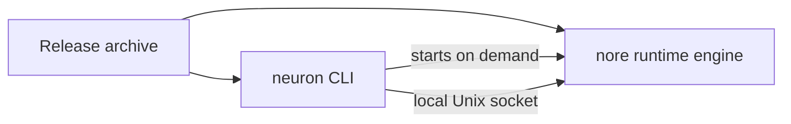

# Installation

**One product, one binary.** The `neuron` CLI and the N.O.R.E. runtime engine ship together in a single archive. You install `neuron`, and the CLI locates and starts the bundled runtime engine for you — there is nothing else to install, start, or maintain.



---

## Supported platforms

Release archives are published for the following platforms:

| Platform | Architectures |
| --- | --- |
| Linux | `amd64`, `arm64` |
| macOS | `amd64`, `arm64` |
| Windows | `amd64` |

Each archive contains both the `neuron` CLI and the `nore` runtime engine. On every platform the product is used the same way: you invoke `neuron`, and the CLI runs the engine.

---

## Option 1 — Install an official release

### 1. Download the archive

Go to the [releases page](https://github.com/neuron-runtime/neuron/releases) and download the archive for your operating system and architecture:

```text
neuron-0.1.0-linux-amd64.tar.gz
neuron-0.1.0-linux-arm64.tar.gz
neuron-0.1.0-darwin-amd64.tar.gz
neuron-0.1.0-darwin-arm64.tar.gz
neuron-0.1.0-windows-amd64.zip
```

Every release also publishes `SHA256SUMS`, the expected cryptographic digests for every archive.

> [!IMPORTANT]
> Verify the archive checksum **before extracting**. See [Verifying the installation](#verifying-the-installation).

Prefer the latest release to keep up to date.

### 2. Extract the archive

The archive contains a single folder, `neuron/`, holding the product binaries.

**Linux / macOS (terminal):**

```bash
tar -xzf neuron-0.1.0-linux-amd64.tar.gz
```

**Windows (PowerShell):**

```powershell
Expand-Archive .\neuron-0.1.0-windows-amd64.zip -DestinationPath .
```

### 3. Put `neuron` on your PATH

Inside the `neuron/` folder you will find the `neuron` executable. Move or link it somewhere on your `PATH`:

```bash
sudo mv neuron/neuron /usr/local/bin/neuron
```

On Windows, add the extracted folder to your `PATH` environment variable, or move `neuron.exe` into a directory already on your `PATH`.

> [!TIP]
> Keep the `nore` binary next to `neuron` in the same directory. When the runtime engine is not found on the system `PATH`, the CLI falls back to a `nore` executable sitting beside itself — which is exactly the layout the release archive ships.

### 4. Verify

```bash
neuron version
```

That is the entire install. There is no daemon to configure, no service to start, and no environment to initialize — the runtime engine ships with the CLI and is started on demand.

---

## Option 2 — Build from source

Building from source is only necessary when contributing, testing unreleased changes, or packaging a custom build.

### Prerequisites

- Go `1.26.5` or newer.
- Node.js — only needed for the TypeScript SDK, not required to build the CLI.

### Clone and build

```bash
git clone https://github.com/neuron-runtime/neuron.git
cd neuron
go build -o neuron ./application/cmd/neuron
```

`application` and `nore` are separate Go modules in a workspace; the command above builds the CLI from within the workspace. The CLI locates the runtime engine by falling back to a `nore` executable in its own directory, a `nore` build inside the source tree, or the system `PATH`; you can pin a specific runtime with `--nore-path` or `daemon.norePath`.

Install the built binary wherever you keep executables:

```bash
sudo mv neuron /usr/local/bin/neuron
```

### Build the runtime engine separately

The CLI and the runtime are separate binaries. To build both for development:

```bash
go build -o neuron ./application/cmd/neuron
go build -o nore ./nore/cmd/nore
```

### Version stamping

Local builds report the development version (`dev`). Official releases stamp the release version into the binary:

```bash
go build -ldflags "-X github.com/neuron-runtime/neuron/shared/version.Version=v0.1.0" \
  -o neuron ./application/cmd/neuron
```

See [scripts/release.sh](../scripts/release.sh) for the release build.

---

## Verifying the installation

### Check the version

```bash
neuron version
# e.g. neuron 0.1.0
```

### Verify the archive checksum

Compare the SHA-256 digest you compute locally with the one published in `SHA256SUMS`.

**Linux / macOS:**

```bash
shasum -a 256 neuron-0.1.0-linux-amd64.tar.gz
```

**Windows (PowerShell):**

```powershell
Get-FileHash .\neuron-0.1.0-windows-amd64.zip -Algorithm SHA256
```

The digest shown must match the published value exactly.

### Smoke-test the full flow

The YAML example is the zero-tooling surface — no SDK build required. From a repository checkout:

```bash
cd examples/ecommerce_order
neuron build
neuron run --params '{
  "order": {
    "id": "ord_1001",
    "customerId": "cus_42",
    "customerEmail": "ada@acme.io",
    "currency": "USD",
    "total": 4250,
    "items": [{ "sku": "SKU-AG-1", "name": "Wireless Mouse", "qty": 1, "priceCents": 4250 }],
    "shippingAddress": { "street": "1 Market St", "city": "San Francisco", "zip": "94105" }
  }
}'
```

A working install streams the assembly's live execution events and finishes in a terminal state (`execution.completed`).

> [!TIP]
> `neuron run` reads the execution params from `--params`; without it the capabilities have no order to work on. For the TypeScript walkthrough (which needs `pnpm install && pnpm build:sdk`) see [docs/GETTING_STARTED.md](./GETTING_STARTED.md).

---

## Uninstalling

Remove the binary from your PATH:

```bash
sudo rm /usr/local/bin/neuron
```

If you want to remove local state created by the CLI and the runtime (registered assemblies, instances, installed modules, and the daemon socket/data), delete the Neuron directory under your home folder:

```bash
rm -r ~/.neuron
```

> [!WARNING]
> Removing `~/.neuron` destroys installed modules, registered assemblies, and execution history. Do it only if you really want a clean slate.

---

## System requirements

- A 64-bit operating system from the [supported table](#supported-platforms).
- Disk space for the binaries (tens of megabytes) plus whatever space registered assemblies, installed modules, and execution records occupy under `~/.neuron`.
- On Linux, the executable bit must be set (true after extraction from a release archive).

External modules are hosted out-of-process by the runtime; executing them has the same system requirements as the module's own platform target.

---

## Notes for Linux users

Release archives are built for glibc-based Linux distributions (`amd64` and `arm64`). If you are on a minimal distribution, verify the runtime engine starts as part of the [smoke test](#smoke-test-the-full-flow).

---

## Troubleshooting

<details>
<summary><strong>`neuron: command not found`</strong></summary>

The binary is not on your `PATH`. Move it onto the `PATH` as in [step 3](#3-put-neuron-on-your-path), then log out and back in or reopen the terminal.

</details>

<details>
<summary><strong>`neuron version` prints nothing / errors</strong></summary>

The binary may be for a different platform, or the archive was extracted partially. Verify the checksum and that you are executing the matching platform build.

</details>

<details>
<summary><strong>Registration fails when the walkthrough references an external module</strong></summary>

External modules must be resolvable through a configured registry. The shipped examples use only built-in modules and need no registry. See [docs/MODULES.md](./MODULES.md) for configuring registries.

</details>

<details>
<summary><strong>The runtime engine cannot be found</strong></summary>

The CLI looks for the `nore` runtime binary beside itself, then in the source tree, then on the system `PATH`. If none is found it reports `nore runtime not found`. Set `daemon.norePath` in config or pass `--nore-path <path>` to point at the runtime binary explicitly.

</details>

<details>
<summary><strong>A stale daemon socket</strong></summary>

If a previous CLI run was killed unusually and `neuron` reports a socket error, remove the stale socket file:

```bash
rm ~/.neuron/nore.sock
```

The CLI recreates it on the next run.

</details>

---

## Releasing

> [!NOTE]
> This section is for maintainers of the Neuron repository. End users never run it.

Each distributable artifact has its own version line and its own tag prefix, so the layers move independently without overwriting each other's releases. Everything is published through **GitHub Actions with OIDC federation** — no long-lived registry tokens or API keys are stored in this repository. The only one-time setup is registering a *trusted publisher* on the registry side.

| Artifact | Registry | Tag | Workflow | Credentials |
| --- | --- | --- | --- | --- |
| `neuron` CLI + N.O.R.E. binaries | GitHub Releases | `v*` | `.github/workflows/release.yml` | `GITHUB_TOKEN` (built in) |
| `@neuron/sdk` | npm | `sdk-v*` | `.github/workflows/publish-sdk.yml` | npm trusted publishing (OIDC) |
| `Neuron.Executor` | NuGet | `dotnet-v*` | `.github/workflows/publish-executor-dotnet.yml` | NuGet trusted publishing (OIDC) |
| `shared` Go module | Go module proxy | `shared/v*` | `.github/workflows/publish-go-sdk.yml` | none (tags only) |
| `packages/executor-sdks/golang` | Go module proxy | `packages/executor-sdks/golang/v*` | `.github/workflows/publish-go-sdk.yml` | none (tags only) |

The binary release (`v*`) is handled by `release.yml` together with `scripts/release.sh`. CI (`ci.yml`) validates Go, the TypeScript SDK, and the release build matrix on every push and pull request.

### npm — `@neuron/sdk`

npm authenticates the workflow with a short-lived OIDC token, but it must know which workflow may publish the package. One-time setup on [npmjs.com](https://www.npmjs.com): open `@neuron/sdk` → **Settings** → **Trusted Publisher** → **GitHub Actions**, then fill in organization `neuron-runtime`, repository `neuron`, workflow name `publish-sdk.yml` (must match the file name exactly), and leave the environment empty unless the workflow uses a protected environment. No `NPM_TOKEN` is needed.

```bash
git tag sdk-v0.1.0
git push origin sdk-v0.1.0
```

The tag version replaces the version in `package.json` before publishing; the tag is the source of truth.

### NuGet — `Neuron.Executor`

One-time setup: create a **Trusted Publishing** policy on [nuget.org](https://www.nuget.org) under **Account → Trusted Publishing → Add policy** with publisher GitHub Actions, repository owner `neuron-runtime`, repository `neuron`, and workflow file `publish-executor-dotnet.yml` (must match exactly). Also add a repository *variable* named `NUGET_USER` holding your nuget.org username — an identifier, not a credential, so it belongs under **Settings → Secrets and variables → Actions → Variables**, not as a secret.

```bash
git tag dotnet-v0.1.0
git push origin dotnet-v0.1.0
```

The tag version is passed to `dotnet pack`/`dotnet build` as `-p:Version`.

### Go modules — `shared` and `packages/executor-sdks/golang`

Go modules have no upload step: a version is published by pushing a tag whose prefix matches the module path.

```bash
git tag shared/v0.1.0
git push origin shared/v0.1.0

git tag packages/executor-sdks/golang/v0.1.0
git push origin packages/executor-sdks/golang/v0.1.0
```

`publish-go-sdk.yml` validates the tagged module (gofmt, `go vet`, `go test`, `go build`) and verifies the tag prefix matches the module path, so a mistyped tag cannot silently declare a version.

### Version synchronization and verification

Each artifact carries its own version and is versioned independently — `@neuron/sdk` from `packages/assembly-sdks/typescript/package.json`, `Neuron.Executor` from `packages/executor-sdks/dotnet/Directory.Build.props`, Go modules from the git tag itself. The tag always overrides the checked-in version at release time; update the checked-in version in the same change that prepares a release if you want the repository to reflect the published version outside of CI.

Verify a published release with `npm view @neuron/sdk version` (plus `dist.attestations` for provenance), `dotnet nuget search Neuron.Executor`, and `go list -m github.com/neuron-runtime/neuron/shared@v0.1.0` through the public proxy.

---

## Related

| | |
| --- | --- |
| **Getting started** | The full run-through — [docs/GETTING_STARTED.md](./GETTING_STARTED.md) |
| **CLI reference** | Every `neuron` command and flag — [application/README.md](../application/README.md) |
| **Modules & capability runtimes** | The unified module model — [docs/MODULES.md](./MODULES.md) |
