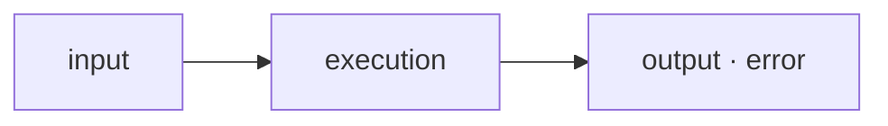
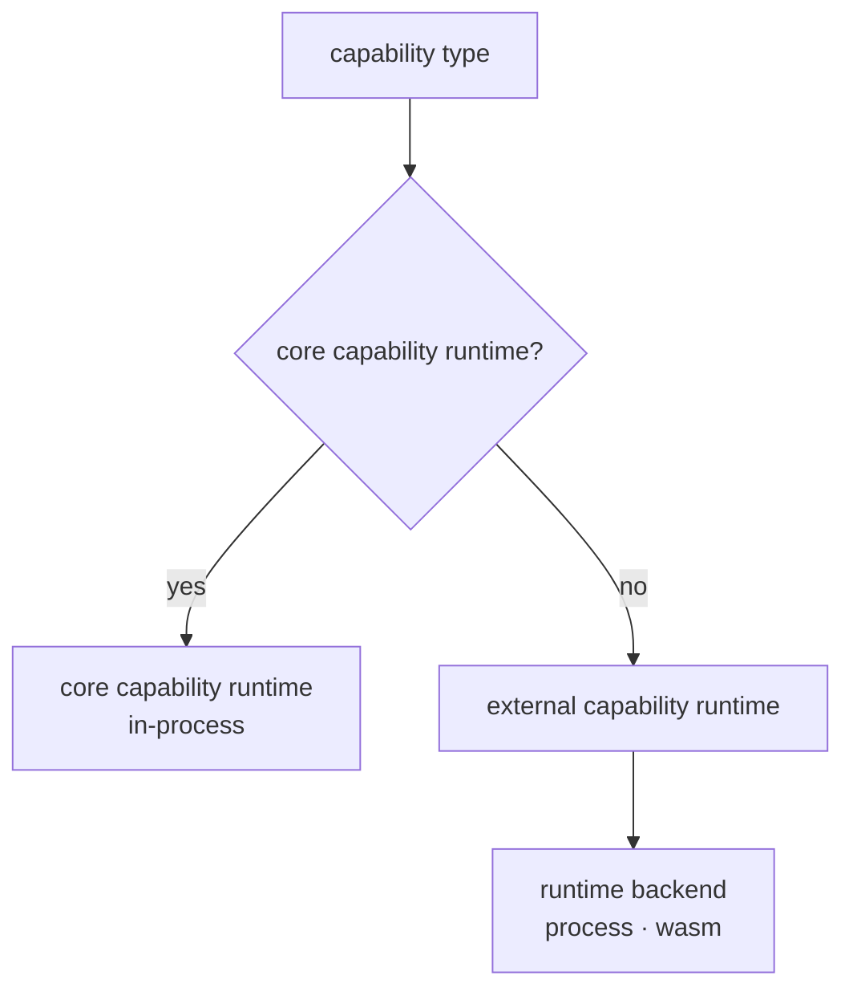
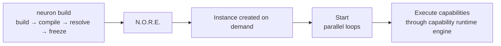
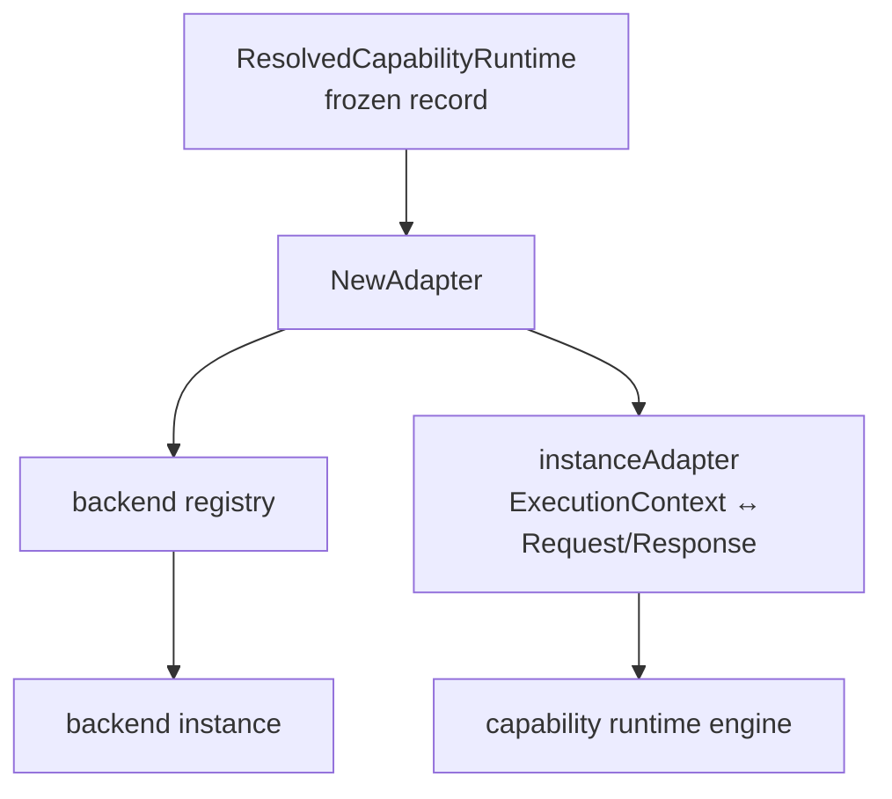

# The N.O.R.E. Runtime

**Maintainer-focused deep dive.** This document describes how N.O.R.E. executes software: the pipeline from an incoming request to a resolved result, the capability runtime contract every capability obeys, the two runtime backends (process and WASM), and how capability runtime authors ship artifacts the runtime can host.

It gives a complete mental model of execution inside N.O.R.E.: what happens at every stage, who owns what, and how a new capability runtime is created and operated.

> [!TIP]
> Prefer the fast path? Read [The execution model](#1-the-execution-model), [The capability runtime contract](#3-the-capability-runtime-contract), and [Executing one capability](#7-executing-one-capability). The two focused docs go deeper: [RUNTIME_PROCESS.md](./RUNTIME_PROCESS.md) and [RUNTIME_WASM.md](./RUNTIME_WASM.md).

---

## 1. The execution model

N.O.R.E. treats every capability as a capability runtime. An execution is always a request/response operation at its core:



The runtime itself does not know what a capability does. It only knows the contract every capability runtime speaks: a params map in, a result map (or a structured error) out. Whatever the capability is — a database query, an HTTP call, a WASM module, a native binary, a remote API — the runtime sees the same shape.

> [!IMPORTANT]
> One Assembly can mix capabilities executed in completely different ways. This is a core property of N.O.R.E.: the Assembly composes capabilities; the runtime hosts them; the capability runtime contract keeps those two independent.

---

## 2. Two kinds of capability runtime

There are two ways a capability type gets a capability runtime:

**Core in-process capability runtimes.** N.O.R.E. ships built-in capability runtimes for common capability types. They run inside the N.O.R.E. process and require nothing to be installed, resolved, or launched:

| Capability type | Capability Runtime |
| --- | --- |
| `set` | Sets static values from config |
| `ai` | In-process mock/placeholder capability runtime |
| `log` | Logs its input |
| `http` | Makes an HTTP request |
| `delay` | Waits a configured interval |
| `command` | Runs an OS command |

They are registered by `RegisterCoreRuntimes` in `nore/internal/registry`, under both the canonical namespaced name (`neuron:core:set`, ...) and the legacy bare name.

**External capability runtimes.** Anything else is hosted by a runtime backend. An external capability runtime is an installed artifact (a native binary or a WASM module) that speaks one of the two declared wire protocols. External capability runtimes are declared as requirements in an assembly, resolved to exact versions at register time, frozen into the deployment as `ResolvedCapabilityRuntime` records, and eventually launched by a runtime backend when the assembly becomes an instance.



The distinction is decided in `nore/internal/plugin.RegisterResolvedCapabilityRuntimes`: a frozen capability runtime is only registered if no core capability runtime already exists for the same capability type. **Core capability runtimes always win.**

---

## 3. The capability runtime contract

Everything the runtime knows about a capability runtime is defined in `shared/types/capabilityruntime`. This module is the contract both sides compile against. It is deliberately dependency-free and carries no registry, resolver, or installer machinery.

Three pieces matter:

### The manifest (`runtime.json`)

Describes one immutable artifact: its name and version, its runtime kind, its entrypoint, its declared protocol, its capabilities, and its per-platform artifacts.

### The protocol

Defines the wire data model of an execution: a `Request` with a `Params` map, and a `Response` with a `Result` map and an optional `Error` string. Two transports carry this data:

| Protocol | Transport | Used by |
| --- | --- | --- |
| `neuron/capability-runtime-v1` | gRPC over a Unix domain socket | Process capability runtimes (canonical) |
| `neuron/capability-runtime-v1-json` | One-shot stdin/stdout JSON | WASI modules and legacy process capability runtimes |

> [!NOTE]
> A non-empty `Error` in a response is a **controlled failure**, even when the process exits zero.

### The backend contract

Three Go interfaces define how a backend hosts an artifact:

```go
type Backend interface {
    Start(ctx context.Context, spec BackendSpec) (BackendInstance, error)
    BackendName() string
}

type BackendInstance interface {
    Execute(ctx context.Context, req *Request) (*Response, error)
    Health(ctx context.Context) error
    Close(ctx context.Context) error
}
```

`BackendSpec` carries everything needed to launch one artifact: the capability runtime type and version, the declared protocol, the absolute entrypoint path, the install root, and an optional worker-pool bound. The returned `BackendInstance` is the uniform execution handle — regardless of whether the underlying capability runtime is a child process, a WASM module, a container, or a remote service.

---

## 4. The backend registry and dispatch

A single registry (`nore/internal/backend.Registry`) owns runtime backends and the instances they launch. Backends register themselves by kind:

```go
reg := backend.New()
reg.Register("process", processRuntime)
reg.Register("wasm", wasmRuntime)
```

`Start(kind, spec)` looks up the backend for the kind and dispatches. If no backend is registered for the requested kind, the start fails with an explicit error listing the supported kinds — a frozen artifact that declares an unsupported or unknown runtime type is **never silently mis-executed**.

`SupportedRuntimeKinds()` in `shared/types/capabilityruntime` lists the two kinds the runtime layer can actually launch: `process` and `wasm`. The `container` and `remote` kinds are reserved for the future and currently rejected.

The registry also tracks launched instances by `type@version`. Closing an instance removes it from the registry; `CloseAll` drains every tracked instance (after in-flight work, as described below).

In the running process there is a single **shared** registry, built lazily and shared by every instance:

- the WASM backend owns process-global compiled-module state that every WASM adapter must share (see [RUNTIME_WASM.md](./RUNTIME_WASM.md));
- the process backend tracks its worker pools by capability runtime identity, so two instances of the same assembly legitimately share one pool per capability runtime.

---

## 5. From assembly to running instance

The flow from registration to execution:



**Register.** `neuron build` builds the project, compiles it to an assembly, resolves every capability runtime requirement against the configured catalogs, installs what is missing, and freezes the exact resolutions into the deployment. The deployment never resolves or installs again. Frozen records are `ResolvedCapabilityRuntime` values: type, requested constraint, exact resolved version, registry, digest, runtime info, and the absolute install root.

**Instance creation.** An instance of the assembly is created on demand through `Manager.GetOrCreate` (`nore/internal/instance`). The manager reads the durable registered assembly, decodes the frozen capability runtime set from the opaque `ExecutionConfigurations` payload, and constructs the instance. Construction:

1. builds the event bus, scheduler, engine, and analytics,
2. registers the core in-process capability runtimes,
3. registers a runtime adapter for every frozen external capability runtime (`plugin.RegisterResolvedCapabilityRuntimes`), and
4. compiles the blueprint for the assembly.

**Start.** `Instance.Start` sets the status to `running` and launches five concurrent loops: analytics, scheduler, capability runtime engine, event persistence, and execution persistence. Until this point nothing is listening.

**Instance stopping.** `Instance.Stop` cancels the instance context, waits for in-flight work to drain, closes the capability runtime registry (which closes every registered adapter, releasing runtime-backed resources), and persists the stopped status.

> [!WARNING]
> Restored instances (reconciled from persisted metadata after a restart) are **metadata-only**: they keep their executions and events queryable but do not restart their capability runtimes.

---

## 6. The adapter boundary

`nore/internal/plugin` is the boundary between frozen capability runtime records and the runtime backends. It owns no process, socket, or WASM machinery itself. It only maps a `ResolvedCapabilityRuntime` onto the contract N.O.R.E.'s capability runtime engine consumes.

`NewAdapter` reads the frozen record's runtime kind and builds a `BackendSpec`:

- an empty runtime kind defaults to `process` (the original capability runtime model);
- an empty protocol defaults to `neuron/capability-runtime-v1-json` so legacy capability runtimes that omit the declaration keep speaking JSON;
- the entrypoint is resolved to an absolute path via `EntrypointPath()`;
- `maxWorkers` from the frozen record is passed through.

It then calls the shared registry's `Start(kind, spec)`. The returned instance is wrapped in an adapter that maps the engine's `ExecutionContext` to a `Request` and back, and turns a non-empty response error into a Go error.



---

## 7. Executing one capability

When an execution flows through the assembly, a capability's capability runtime is resolved from the registry (core capability runtime or adapter) and invoked with an `ExecutionContext`: the execution and correlation IDs, the capability definition, the resolved params, and a logger bound to the execution.

The capability runtime returns the result map. Errors from the capability runtime are distinguished:

| Case | Meaning |
| --- | --- |
| Go error from the adapter | Real failure (`Execute` RPC failed, worker died, process crashed, timeout) |
| Empty error + response | Success; response carries the result |
| Non-empty response `Error` | Controlled failure surfaced downstream without the transport failing |

> [!NOTE]
> Execution history and events are an observability and persistence concern, not part of the execution semantics: an execution does not depend on persistence being enabled.

---

## 8. Runtime backends

The runtime backends are the only place launch machinery lives. Both implement the same `Backend` interface; each owns its own process, socket, or module state.

### The process runtime

The process runtime hosts external capability runtimes as OS child processes. Two transports are supported, selected by the frozen record's declared protocol:

- `neuron/capability-runtime-v1`: the capability runtime is a long-lived gRPC server over a Unix domain socket. The runtime keeps a pool of worker processes per capability runtime type, leasing executions to idle workers. This is the canonical transport for process capability runtimes, documented in detail in [RUNTIME_PROCESS.md](./RUNTIME_PROCESS.md).
- `neuron/capability-runtime-v1-json`: the capability runtime is a one-shot command. Each execution spawns a fresh process, feeds it a JSON request on stdin, and reads a JSON response from stdout. This is the legacy transport and the one used by WASI modules.

### The WASM runtime

The WASM runtime hosts external capability runtimes as `wasm32-wasi` modules inside the embedded wazero runtime. It always uses the stdin/stdout JSON transport because WASI preview1 has no socket interface. It keeps a process-global wazero runtime and a compiled-module cache shared by every instance. Documented in detail in [RUNTIME_WASM.md](./RUNTIME_WASM.md).

### Unsupported kinds

A frozen record whose runtime kind is neither `process` nor `wasm` (for example `container` or `remote`) is rejected at adapter creation with an explicit unsupported-runtime error. The runtime never guesses: an artifact that cannot be hosted correctly is never started.

---

## 9. How capability runtimes are created

A capability runtime is an artifact that an assembly's capability types resolve to. Creating one means producing two things:

**The artifact.** Either a native binary or script that speaks one of the two protocols, or a `wasm32-wasi` module that reads a JSON request from stdin and writes a JSON response to stdout.

For process capability runtimes that want the gRPC transport, the fastest path is the Go SDK (`packages/executor-sdks/golang`): implement a `Handler`, call `Serve`, and the SDK handles sockets, readiness, negotiation, and lifecycle. The SDK transparently falls back to the JSON transport when launched without a socket, so one binary serves both. Capability runtime authors are not required to write Go: the gRPC protocol is language-independent (`shared/protocol/capabilityruntime/v1/capability_runtime.proto`), and the JSON protocol is trivially implemented anywhere.

**The manifest.** Every capability runtime ships a `runtime.json`:

```json
{
  "apiVersion": "neuron/v1",
  "kind": "CapabilityRuntime",
  "metadata": { "name": "my:capability", "version": "1.2.0" },
  "runtime":  { "type": "process", "entrypoint": "capability", "protocol": "neuron/capability-runtime-v1" },
  "capabilities": ["capability"],
  "features": [],
  "platforms": { "linux-amd64": { "artifact": "capability-linux-amd64", "sha256": "..." } }
}
```

The `runtime.type` selects the backend (`process` or `wasm`); the `protocol` selects the transport; `maxWorkers` (optional) bounds the worker pool for process capability runtimes. Validation requires a correct `apiVersion` and `kind`, a name, a version, a runtime type, an entrypoint, and at least one capability.

`platforms` keys are selected by the runtime kind: process capability runtimes bind the host's native key (`linux-amd64`, ...) because the artifact runs on the N.O.R.E. machine, while WASM capability runtimes bind the portable `wasm32-wasi` key. The mapping lives in one place, `PlatformForRuntime` (`application/capabilityruntime/model.go`). The preferred distribution unit is the capability runtime package archive (`<name>-<version>-capability-runtime.neuron.tar.gz`) carrying `runtime.json` plus every platform artifact; registries prefer it over per-platform assets and the installer reconciles its inner manifest against the resolved identity.

Manifests declare the protocol honestly:

- a gRPC-capable process capability runtime declares `neuron/capability-runtime-v1`;
- a WASI module or legacy command declares `neuron/capability-runtime-v1-json`.

From there the normal evolution holds: the artifact is distributed through a registry, resolved by requirement, verified and installed into the store, frozen into a deployment, and finally operated by the matching runtime backend.

---

## 10. Timeouts and failure semantics

Every backend enforces a defensive execution bound (10 minutes by default) when the caller context carries no deadline; the stricter of the two applies when the caller does carry one. Runaway behavior never blocks the process:

- process capability runtimes are reaped by timeout and the pool restarts workers;
- WASM modules are interrupted by wazero's close-on-context-done and their module is torn down.

Successful and failed executions both flow back through the same response contract. Controlled failures (a non-empty `error`) and transport failures are distinguishable to callers.

---

## 11. Summary

- Execution is always params in, result (or structured error) out.
- Core capability types are executed in-process; everything else is an external capability runtime hosted by a runtime backend.
- `shared/types/capabilityruntime` is the sole contract: manifest, protocol, backend, instance.
- The backend registry dispatches by declarative runtime kind; unknown kinds are rejected, never guessed.
- The plugin layer is a thin adapter between frozen records and backends.
- The process runtime runs child processes (gRPC worker pool or one-shot JSON); the WASM runtime runs `wasm32-wasi` modules over the JSON transport.
- Capability runtimes are created as an artifact plus a manifest, distributed through registries, resolved and frozen at register time, and launched unchanged by the runtime.

---

## Related

| | |
| --- | --- |
| **Process runtime** | The process capability runtime backend in detail — [RUNTIME_PROCESS.md](./RUNTIME_PROCESS.md) |
| **WASM runtime** | The WASM capability runtime backend in detail — [RUNTIME_WASM.md](./RUNTIME_WASM.md) |
| **Modules & capability runtimes** | The unified module model — [MODULES.md](./MODULES.md) |
| **Architecture** | Boundaries and data flow — [ARCHITECTURE.md](./ARCHITECTURE.md) |
| **Go SDK** | Author a capability runtime — [packages/executor-sdks/golang/README.md](../packages/executor-sdks/golang/README.md) |