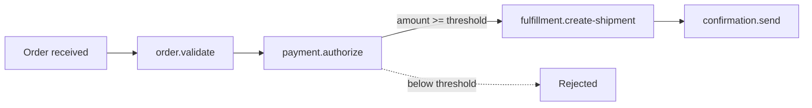
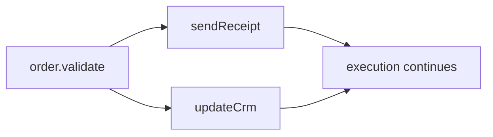

# `@neuron/sdk`

A TypeScript SDK for defining **typed, composable Neuron assemblies** — describe capabilities, their contracts, and how they connect. The SDK compiles everything into a portable JSON **manifest** that the Neuron compiler and runtime consume.

```mermaid
flowchart LR
    A[TypeScript<br/>define capabilities, contracts, connections] --> B[@neuron/sdk]
    B --> C[AssemblyManifest<br/>canonical JSON]
    C --> D[neuron compiler]
    D --> E[N.O.R.E. runtime]
```

> [!IMPORTANT]
> The SDK defines assemblies. It does not execute them.
> The manifest it produces is consumed by the Neuron compiler and runtime.

[](https://github.com/neuron-runtime/neuron/releases)
[](https://www.typescriptlang.org)
[](../../../LICENSE)

---

## Quick install

```bash
pnpm add @neuron/sdk
```

---

## The scenario

Throughout this guide, a single production scenario illustrates every SDK feature: **marketplace order fulfillment**.



Six capabilities, typed contracts, a conditional guard, and a final manifest. By the end of this guide you will have defined the entire pipeline.

---

## Define a capability

A `Capability` is a named unit of work. Every capability has an **identity**, a **capability runtime** (the machinery that runs it), and typed **params/results contracts**.

```ts
import { Capability } from "@neuron/sdk";

const validateOrder = Capability({
  name: "order.validate",
  version: "1.0.0",
  description: "Validate an incoming order before processing",
})
  .capabilityRuntime({ name: "neuron:core:set" })
  .paramsSchema<{ order: Order }>()
  .resultSchema<{ order: Order }>();
```

| Field | Purpose |
| --- | --- |
| `name` | Logical identity — the name capabilities, bindings, and the assembly reference |
| `version` | Semver version — tracked in the manifest and frozen into registrations |
| `description` | Human-readable purpose (optional, for documentation and registries) |

> [!NOTE]
> Capability runtime names follow the `owner:capability:sub` convention (for example `neuron:core:set`, `example:echo`, `github:read`), so a capability without an explicit `.capabilityRuntime()` defaults to the in-process built-in `neuron:core:set` and runs without any registry or installation. To run a capability through an external module — a signed process or a WebAssembly worker — set `.capabilityRuntime({ name: "<owner>:<capability>", version, registry })` explicitly; the resolved artifact is verified and frozen at `neuron build` time. See [docs/MODULES.md](../../../docs/MODULES.md).

---

## Contracts — what goes in and out

Contracts tell TypeScript exactly what a capability accepts and produces. Two approaches are available, and you can mix them freely.

### Typed contracts (generic form)

The preferred approach for TypeScript: the contract is a TypeScript type. Autocomplete, wrong-field errors, and type mismatches are caught at compile time.

```ts
type Order = {
  id: string;
  customerId: string;
  customerEmail: string;
  currency: string;
  totalCents: number;
  items: { sku: string; name: string; qty: number; priceCents: number }[];
  shippingAddress: { street: string; city: string; zip: string };
};

const validateOrder = Capability({
  name: "order.validate",
  version: "1.0.0",
})
  .capabilityRuntime({ name: "neuron:core:set" })
  .paramsSchema<{ order: Order }>()
  .resultSchema<{ order: Order }>();
```

The generic form produces type-safe expressions everywhere: `validateOrder.result.order` is fully typed, and referencing a field that doesn't exist is a compile error.

### Runtime schema builders

For cases where runtime validation rules are needed — maximum lengths, required fields, format constraints — the SDK provides builder functions:

```ts
import { string, number, boolean } from "@neuron/sdk";

const authorizePayment = Capability({
  name: "payment.authorize",
  version: "1.0.0",
}).paramsSchema({
  orderId: string().required(),
  amountCents: number().min(1),
  currency: string().required(),
}).resultSchema({
  authorizationId: string().required(),
  approved: boolean(),
});
```

Runtime rules are encoded into the manifest alongside the structural schema, giving the runtime validation information it can enforce before execution.

> [!NOTE]
> You cannot mix the generic form and the builder form for the same capability. Choose the form that best fits the capability's contract.

---

## Expressions — referencing data across capabilities

When capabilities are composed, data flows between them. Expressions provide a typed, safe way to reference any field in a capability's result or params without constructing raw strings.

```ts
validateOrder.result.order          // Expression<Order>
validateOrder.result.order.id       // Expression<string>
authorizePayment.result.approved    // Expression<boolean>
```

Autocomplete shows exactly the declared result fields. Referencing an unknown field is a compile error:

```ts
// @ts-expect-error — `nonExistent` is not a declared result
validateOrder.result.nonExistent
```

### Conditions

Expressions carry comparison operators that build guard conditions:

```ts
import { type Expression } from "@neuron/sdk";

const approved: Expression<boolean> =
  authorizePayment.result.approved.equals(true);

const thresholdMet: Expression<boolean> =
  authorizePayment.result.amountCents.greaterThanOrEqualTo(1000);
```

Available operators: `equals`, `notEquals`, `greaterThan`, `greaterThanOrEqualTo`, `lessThan`, `lessThanOrEqualTo`, `and`, `or`.

---

## Binding params to a capability

`.withParams({ ... })` binds a capability's params to values, expressions, or a connection. It is the primary way to feed data into a capability.

### Automatic binding with expressions

Map another capability's result fields to this capability's params:

```ts
authorizePayment.withParams({
  order: validateOrder.result.order,
  amountCents: validateOrder.result.order.totalCents,
  currency: validateOrder.result.order.currency,
});
```

Every binding is checked against the target's params schema at compile time — wrong field names and wrong types are caught before you run anything:

```ts
// @ts-expect-error — currency is string, but orderId expects string +
// the expression resolves to a different string type mismatch
authorizePayment.withParams({
  orderId: validateOrder.result.order.totalCents, // number, not string
});
```

### Literal values

Bindings can include static values alongside expressions:

```ts
githubRead.withParams({
  owner: "neuron-runtime",
  repository: "neuron",
  path: "README.md",
});
```

---

## Composing capabilities — `.bind()`

`.bind()` collects capability invocations into a **flat composition**. Execution edges are derived from the data each capability references: a target names its predecessor by reading the previous capability's `.result`, and the compiler produces the incoming binding for it. There is no explicit pipeline or parallel operator in the SDK — concurrency is the shape of the references.

```ts
const pipeline = validateOrder
  .withParams({ order: assemblyInput.order })
  .bind(
    authorizePayment.withParams({
      order: validateOrder.result.order,
      amountCents: validateOrder.result.order.totalCents,
      currency: validateOrder.result.order.currency,
    })
  )
  .bind(
    capturePayment.withParams({
      order: authorizePayment.result.order,
      amountCents: authorizePayment.result.amountCents,
    })
  );
```

`authorizePayment` reads `validateOrder.result` and `capturePayment` reads `authorizePayment.result`, so the bindings are `validate-order → authorize-payment → capture-payment`.

A target that references no capability directly — a bare capability, empty bindings, or a connection-driven mapping — falls back to the `.bind()` receiver it was chained after, so chains written without result references still order correctly.

### Guard conditions

The second argument to `.bind()` is an optional guard. The next step runs **only when the condition holds**. If it fails, a controlled failure is recorded with the given message:

```ts
authorizePayment.bind(
  capturePayment.withParams({
    order: authorizePayment.result.order,
    amountCents: authorizePayment.result.amountCents,
  }),
  {
    when: authorizePayment.result.amountCents.greaterThanOrEqualTo(1000),
    message: "Payment below authorization threshold",
  }
);
```

Guard conditions are compiled into the manifest's binding validation rules, and evaluated at runtime by the CEL resolver.

---

## Explicit mapping — `.connect()`

When automatic field-by-field binding isn't enough — different field names, a transformation, or referencing a source that isn't the direct previous step — use `.connect()` to define an explicit mapping.

`.connect()` is fully typed: the callback receives the source result, and the returned object is checked against the target's params schema:

```ts
import { connect } from "@neuron/sdk";

// Map a GitHub-read result to an analyzer's expected params shape
const githubToAnalyzer = connect<GitHubReadOutput, AnalyzeInput>(
  (source) => ({
    content: source.result.content,
    path: source.result.path,
    region: "us-east-1", // literal value
  })
);

analyzeContent.withParams(githubToAnalyzer);
```

You can pass the connection directly to `.bind()`:

```ts
githubRead.bind(analyzeContent.withParams(githubToAnalyzer));
```

### Adding conditions to a connection

Connections support `.when()` for conditional logic — useful when a filter should gate an entire mapping:

```ts
import { connect } from "@neuron/sdk";

const verifiedOnly = connect<{ verified: boolean; id: string }, { id: string }>(
  (src) => ({ id: src.result.id })
).when(src.result.verified.equals(true), "User not verified");

saveUser.withParams(verifiedOnly);
```

Reference a field that doesn't exist on the source and TypeScript catches it:

```ts
connect<{ id: string }, { content: string }>((source) => ({
  // @ts-expect-error — source result has no `content` field
  content: source.result.content,
}));
```

---

## Derived concurrency

Two capabilities that reference the **same** capability's result run in **parallel** — no `Parallel(...)` helper exists. The compiler emits one binding per reference, and the runtime schedules independent fan-out branches concurrently:

```ts
const notify = validateResult
  .withParams({ order: assemblyInput.order })
  .bind(sendReceipt.withParams({ email: validateResult.result.customerEmail }))
  .bind(updateCrm.withParams({ customerId: validateResult.result.customerId }));
```

Both `sendReceipt` and `updateCrm` read `validateResult.result`, so the manifest carries two bindings from `validate-result` — a fan-out the execution engine runs in parallel:



Independent entries (capabilities with no incoming references and no `.bind()` anchor) also run in parallel: pass an array to `.run()`:

```ts
Assembly({ name: "audit", version: "1.0.0" })
  .run([
    recordEvent.withParams({ level: "info" }),
    flushLogs.withParams({}),
  ]);
```

A capability that reads from **multiple** capabilities is fan-in and is rejected at `toManifest()` time — execution does not support it. Route such inputs through an aggregation capability instead.

---

## The assembly — composing the full pipeline

An `Assembly` ties everything together. It declares the assembly's identity, an optional typed input contract, and the capability composition:

```ts
import { Assembly } from "@neuron/sdk";

const manifest = Assembly({
  name: "order-fulfillment",
  version: "1.0.0",
  description: "Validate, authorize, and fulfill customer orders",
})
  .paramsSchema<{ order: Order }>()
  .withParams((data) =>
    validateOrder
      .withParams({ order: data.order })
      .bind(
        authorizePayment.withParams({
          order: validateOrder.result.order,
          amountCents: validateOrder.result.order.totalCents,
          currency: validateOrder.result.order.currency,
        })
      )
      .bind(
        createShipment.withParams({
          order: authorizePayment.result.order,
        }),
        {
          when: authorizePayment.result.amountCents.greaterThanOrEqualTo(1000),
          message: "Payment authorization threshold not met",
        }
      )
      .bind(
        sendConfirmation.withParams({
          order: createShipment.result.order,
          email: createShipment.result.order.customerEmail,
        })
      )
  )
  .toManifest();

export default manifest;
```

### `.withParams()` vs `.run()`

| Method | Use when |
| --- | --- |
| `.withParams((data) => ...)` | The assembly receives typed input that feeds into the first capability |
| `.run(firstCapability.withParams({...}))` | The first capability has all its inputs resolved at build time (no runtime input) |

`.withParams()` calls `.run()` internally — the difference is purely ergonomic. The `data` parameter is typed by the preceding `.paramsSchema<T>()` and compiled into `execution.params` references in the manifest. Both accept a single composition, a single capability invocation, or an array of independent entries.

---

## What `toManifest()` produces

`toManifest()` flattens the authored composition, collects every capability definition, derives the bindings from each capability's data references, and produces the final manifest:

```json
{
  "apiVersion": "neuron/v1",
  "kind": "Assembly",
  "metadata": {
    "name": "order-fulfillment",
    "version": "1.0.0",
    "description": "Validate, authorize, and fulfill customer orders"
  },
  "capabilities": [
    { "name": "order.validate", "version": "1.0.0", "capabilityRuntime": { "name": "neuron:core:set" }, "params": [...], "results": [...] },
    { "name": "payment.authorize", "version": "1.0.0", "capabilityRuntime": { "name": "neuron:core:set" }, "params": [...], "results": [...] }
  ],
  "bindings": [
    { "from": "order.validate", "to": "payment.authorize", "mappings": [...], "validations": [...] }
  ]
}
```

| Field | What it contains |
| --- | --- |
| `capabilities` | Every capability definition — identity, runtime, contracts, validation rules |
| `bindings` | Derived connections — field mappings and guard conditions between capabilities |

> [!NOTE]
> You never author `bindings` directly. The SDK derives them from `.bind()`, `.withParams()`, and `.connect()` calls and the references those bindings carry.

---

## The CLI

The SDK ships a small CLI to build your project into a manifest:

```bash
npx neuron-sdk build
```

This compiles the entry file (default `index.ts`) and writes the manifest to `.neuron/manifest.json`.

```bash
npx neuron-sdk build --entry assembly.ts   # build a specific entry file
npx neuron-sdk version                   # print the SDK version
npx neuron-sdk help                      # show usage
```

### Entry selection

The entry file default-exporting the manifest (`Assembly(...).toManifest()`) is selected by passing `--entry` to `neuron-sdk build`. When the SDK is driven through the `neuron` CLI (the normal path for a project), the entry is taken from the project's `neuron.config.*` `entry` field and forwarded as `--entry`; no SDK-side configuration file exists.

---

## Package exports

| Export | Purpose |
| --- | --- |
| `Capability` | Define a named capability with runtime, contracts, and metadata |
| `Assembly` | Define an assembly identity, input schema, and capability composition |
| `connect` | Explicit field mappings between source result and target input |
| `string`, `number`, `boolean`, `list`, `record` | Runtime schema builders with validation rules |
| `Expression` | Typed proxy representing a capability result field |
| `CapabilityDefinition`, `CapabilityReference` | Capability identity and reference types |
| `Composition`, `CompositionNode`, `CapabilityComposition`, `Connection`, `ParamBindings`, `ExecutionConfig` | Composition and binding internals |
| `AssemblyManifest`, `CapabilityManifest`, `BindingManifest` | Manifest structure types |
| `Infer`, `Schema`, `SchemaField` | Schema type inference |

---

## Development

```bash
pnpm install          # link workspace
pnpm build:sdk        # build to dist/ via tsup
pnpm test:sdk         # run vitest
pnpm typecheck:sdk    # tsc --noEmit
```

Tests live in `packages/assembly-sdks/typescript/test/` and cover capabilities, expressions, bindings, connections, schemas, and full assembly manifests.

## Versioning and compatibility

- Current version: **0.1.0**
- The public API surface listed above is treated as a contract; changes are tracked and documented
- The SDK is developed in this monorepo and consumed from source via `pnpm install`
- Language target: modern Node.js with full TypeScript 5.x support; the SDK builds to ESM and CJS

## License

[MIT](https://github.com/neuron-runtime/neuron/blob/main/LICENSE) — see the repository `LICENSE` for terms.
